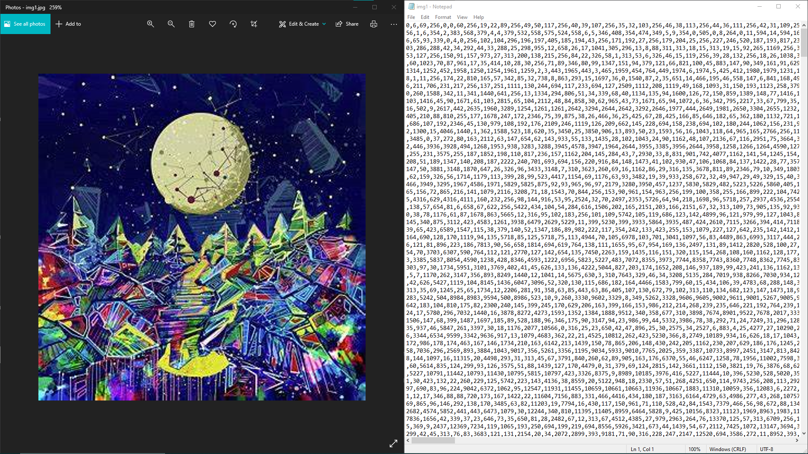

# Data Compression LZW


## Data Compression

Data compression is a technique for reducing the size of data by removing duplication and unnecessary information to store it and lowering the time it takes to send it. We require data compression for a variety of reasons.In the case of text data, it contains many words, and in turn words contain many characters. So, to store a text, we must first store all words, and then all words must be stored. This form of storage necessitates a lot of areas. As a result, a technique to reduce the size of data so that it takes up less space is required. Data compression technique helps in saving storage space by reducing the volume of data, without affecting its quality. Compression methods are of two types - lossy and lossless. In lossless compression, no data is lost. Lossy compression, on the other hand, reduces bits by deleting unneeded or less relevant data. Here we will be focussing on lossless compression technique using LZW algorithm 

## LZW

Abraham Lempel, Jacob Ziv, and Terry Welch devised the Lempel–Ziv–Welch (LZW) algorithm. It is a universal lossless data compression algorithm which means that no data is lost when compressing. Welch published it in 1984 as an improved version of Lempel and Ziv's LZ78 algorithm, which was published in 1978. In hardware implementations, the technique is straightforward to implement and has the potential for very high throughput.This algorithm is commonly used in GIF and, to a lesser extent, PDF and TIFF. Among other things, the 'compress' command in Unix. It is lossless, which means that no data is lost during the compression process.The Idea relies on recurring patterns to save data space. Reading a sequence of symbols, arranging the symbols into strings, and translating the strings into codes is how LZW compression works. We achieve compression because the codes take up less space than the strings they replace.This algorithm has several advantages. It requires no prior information about the input data stream. It can compress the input stream in one single pass. One of the main advantages is its simplicity which allows fast execution 


## Performance

|   File    | Size before compression | Size after compression | Compression ratio | Compress time | Decompress time |
|   :---:   | :---: | :---: | :---: | :---:  |  :---: |
|   File1   | 99KB  | 76KB  |  77%  | 6.14s  |  0.34s |
|   File2   | 296KB | 214KB |  72%  | 6.32s  |  0.8s  |
|   File3   | 527KB | 363KB |  68%  | 12.44s |  1.21s |
| check.tif | 478KB | 124KB |  26%  |   7s   |  0.7s  |
|  cup.tif  | 256KB | 113KB |  44%  |   3s   |  0.4s  |
| small.tif |  8KB  | 0.3KB | 0.03% |  0.1s  | 0.002s |


## Screenshots
<p>
 
 
 
 
 
 
</p>

## Installation

To use it first clone the repository and install the required packages

```bash
git clone https://github.com/Arya292/Data_Compression-LZW-
cd Data_Compression-LZW-
pip3 install -r requirements.txt
```

## Usage

To use it just run

```bash
python3 app.py
```

You will get a graphical interface where you can select files and compress or decompress them


## References

- [C0322226.pdf (ajer.org)](https://ajer.org/papers/v3(2)/C0322226.pdf)
- [13_Implementation of LZW Algorithm for Binary Lossless Data Compression.pdf](https://www.niet.co.in/nietpfd/13_Implementation%20of%20LZW%20Algorithm%20for%20Binary%20Lossless%20Data%20Compression.pdf)
- [https://courses.cs.washington.edu/courses/cse326/05au/lectures/lecture19.pdf](https://courses.cs.washington.edu/courses/cse326/05au/lectures/lecture19.pdf)
- [https://commandlinefanatic.com/cgi-bin/showarticle.cgi?article=art010](https://commandlinefanatic.com/cgi-bin/showarticle.cgi?article=art010)
- [https://www2.cs.duke.edu/csed/curious/compression/lzw.html](https://www2.cs.duke.edu/csed/curious/compression/lzw.html)


