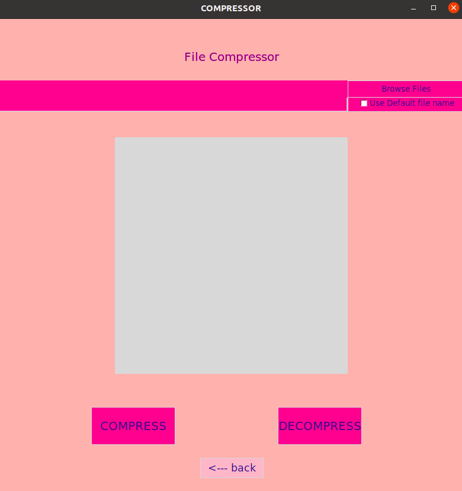

## Data Compression

Data compression technique helps in saving storage space by reducing the volume of data, without affecting its quality. Compression methods are of two types - lossy and lossless. In lossless compression, no data is lost. Lossy compression, on the other hand, reduces bits by deleting unneeded or less relevant data. Here we will be implementing lossless compression technique using LZW algorithm 

## LZW
The Idea relies on recurring patterns to save data space. Reading a sequence of symbols, arranging the symbols into strings, and translating the strings into codes is how LZW compression works. We achieve compression because the codes take up less space than the strings they replace.This algorithm has several advantages. It requires no prior information about the input data stream. It can compress the input stream in one single pass. One of the main advantages is its simplicity which allows fast execution 


## Performance

|   File    | Size before compression | Size after compression | Compression ratio | Compress time | Decompress time |
|   :---:   | :---: | :---: | :---: | :---:  |  :---: |
|   File1   | 99KB  | 76KB  |  77%  | 6.14s  |  0.34s |
|   File2   | 296KB | 214KB |  72%  | 6.32s  |  0.8s  |
|   File3   | 527KB | 363KB |  68%  | 12.44s |  1.21s |
| check.tif | 478KB | 124KB |  26%  |   7s   |  0.7s  |
|  cup.tif  | 256KB | 113KB |  44%  |   3s   |  0.4s  |
| small.tif |  8KB  | 0.3KB | 0.03% |  0.1s  | 0.002s |


## Screenshots
<p>
 
 
 
 
 
</p>

## Installation

To use it first clone the repository and install the required packages

```bash
git clone https://github.com/Arya292/Data_Compression-LZW-
cd Data_Compression-LZW-
pip3 install -r requirements.txt
```

## Usage

To use it just run

```bash
python3 app.py
```

You will get a graphical interface where you can select files and compress or decompress them


